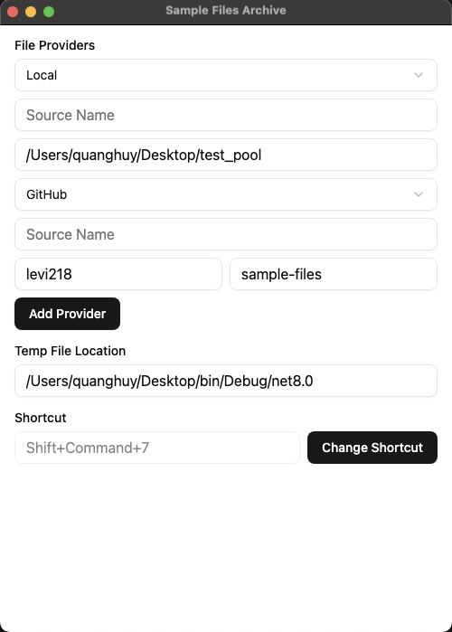
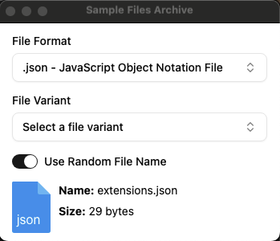

# Sample Files Archive Utility

This is a utility application designed to manage and retrieve sample files from configured repositories. The application allows users to select files from repositories (e.g., GitHub or local directories) and drag and drop them into other applications for testing or other purposes.

## Features

- **File Providers**: Configure multiple file providers, such as GitHub repositories or local directories, to fetch sample files.
- **File Selection**: Select files based on format and variants using an intuitive dropdown interface.
- **Drag-and-Drop**: Drag and drop selected files into other applications for testing or integration purposes.
- **Temporary File Management**: Configure a temporary file location for storing downloaded files.
- **Custom Shortcuts**: Set up a keyboard shortcut to quickly access the application.
- **Dark Theme**: Supports a dark theme for better usability in low-light environments.

## Use Cases

1. **Testing Applications**: Quickly retrieve and drag sample files into testing environments or applications.
2. **File Format Validation**: Validate how different file formats behave in your application.
3. **Development and Debugging**: Use sample files to debug or develop features in your software.
4. **File Management**: Organize and manage sample files from multiple repositories in one place.

## Installation

Clone the repository and install dependencies:

```bash
git clone https://github.com/your-repo/sample-files-archive.git
cd sample-files-archive
yarn install
```

## Starting the Application

Run the application in development mode:

```bash
yarn start
```

## Packaging for Production

To package the application for your platform:

```bash
yarn run package
```

## Configuration

### File Providers
- Add file providers (e.g., GitHub or local directories) in the **Settings** page.
- Configure provider-specific details such as repository name, username, or root folder.

### Temporary File Location
- Set a directory for storing temporary files. This can be configured in the **Settings** page.

### Shortcut
- Assign a custom keyboard shortcut to quickly open the application.

## How to Use

1. Open the application and configure file providers in the **Settings** page.
2. Select a file format and variant from the dropdown menus.
3. Drag and drop the selected file into your desired application or environment.

## Screenshots


*Settings page for configuring file providers and other options.*


*File selection interface with drag-and-drop functionality.*

## License

This project is licensed under the MIT License.
